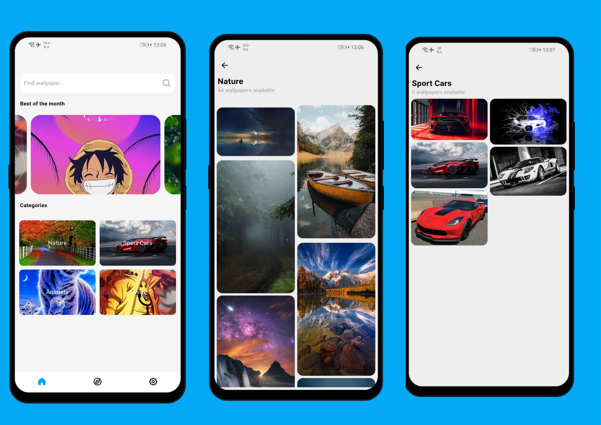
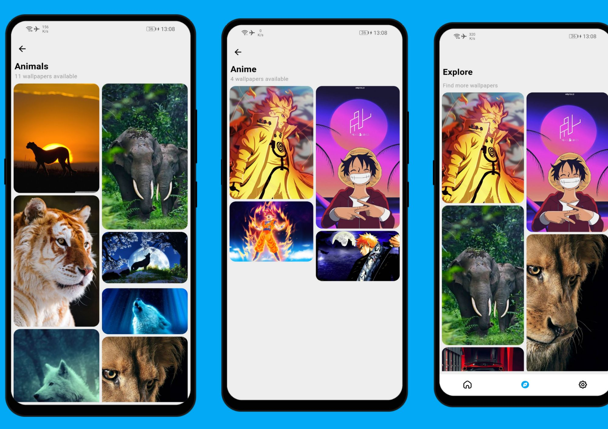
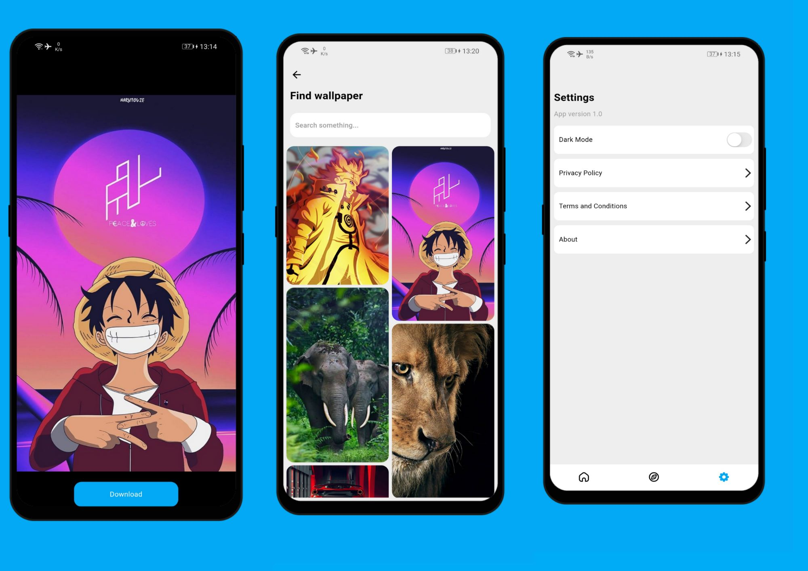

# Wallpaper Verse Application.

Best Android and IOS wallpaper application.

## Whats new!

- Added the dark mode feature.
- You can now search wallpapers.

## Features.

- Carousel Slider.
- Save image to gallery.
- 4 Categories.
- More than 20 wallpapers uploaded per day.
- Explore wallpapers.

## Screenshots.

These are the screenshots for the app.

## Technologies used.

- Firebase Firestore.
- Firebase Storage.

## Packages used.

 flutter_staggered_grid_view: ^0.6.2
  cloud_firestore: ^4.4.3
  firebase_storage: ^11.0.14
  flutter_svg: ^1.1.6
  firebase_core: ^2.7.0
  permission_handler: ^10.2.0
  gallery_saver: ^2.3.2
  carousel_slider: ^4.2.1
  shimmer: ^2.0.0
  fluttertoast: ^8.2.1
  firebase_analytics: ^10.1.5
  provider: ^6.0.5
  shared_preferences: ^2.0.18

## Contributing 

I will be glad if you contribute to this project and help grow wallpaper verse together.

## Admin Application.

I also made the admin app you must check from this link.

[Admin Application](https://github.com/KarlMathuthu/Wallpaper-verse-admin.git)

## Developer

Made with ❤ by Karl Mathuthu.
